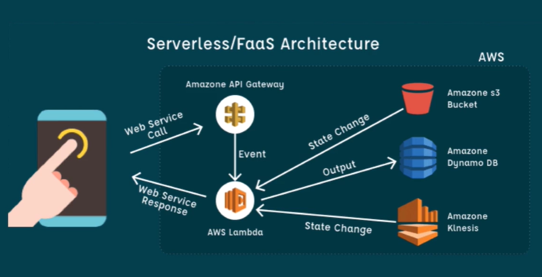

# Introdução à apps Serverless - Analisando imagens com AWS Rekognition

Programação orientada a eventos.

Exemplos:
- HTTP Events
- New Message
- Someone wrote a new file
- Log pattern
- CRON routine
- New item on DB

- Pague o que usar!
- Plataformas gerenciam a execução de seu código - "vendor lock-in"

Concorrentes serverless:
- IBM OpenWhisk
- AWS Lambda
- Azure Functions
- Google Cloud Functions
- Auth0 Webtask

## Lambda

- Procurar serviço "Lambda"
- Criar novo, com um nome, configurações default
- Alteração dos dados pegando `event.queryStringParameters`

## Limitações
- Cold start e idle timeout
- O tempo varia por linguagem e por memória da máquina
- Ambiente da serverless - Amazon Linux baseada em CentOS

## Pricing
- $0.20 per 1M requests
- O mais importante é o tempo - 10s ou mais de execução, não é recomendável

## Serverless Framework
- Abstração para nuvens - mas é muito melhor para AWS